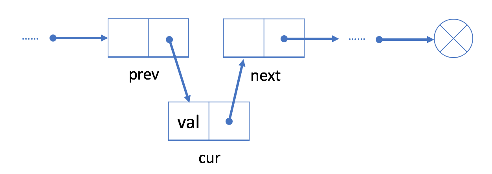
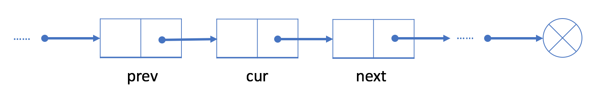
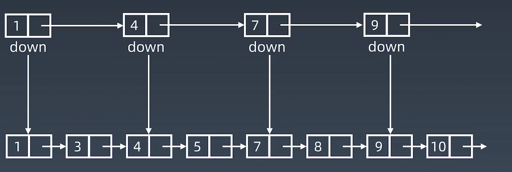
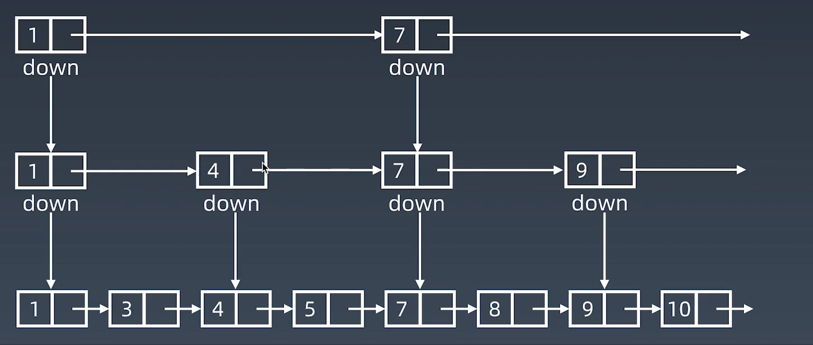
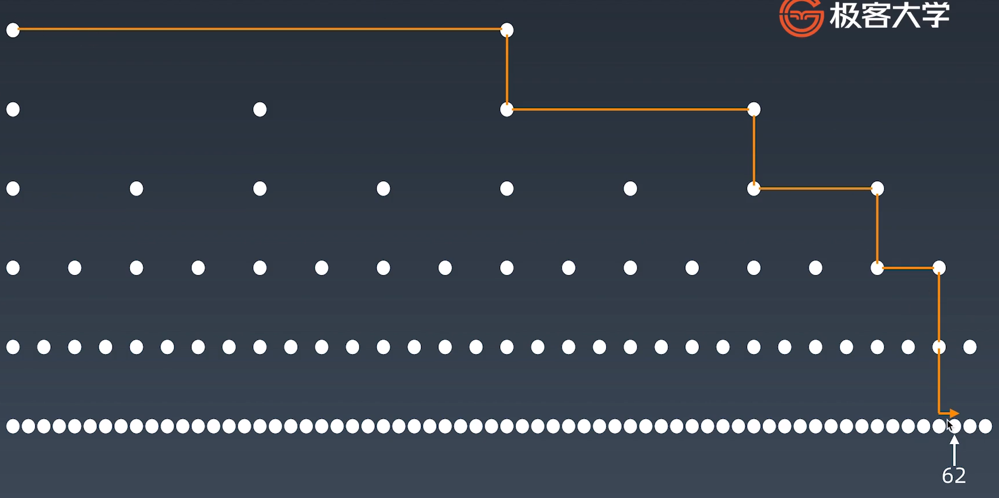

# Week 1 Study Note
## Array
### Insertion 
#### Inserting at the End of an Array
 All we need to do for inserting an element at the end is to assign the new element to one index past the current last element.
```
// Declare an integer array of 6 elements
int intArray = new int[6];
int length = 0;

// Add 3 elements to the Array
for (int i = 0; i < 3; i++) {
    intArray[length] = i;
    length++;
}
```

#### Inserting at the Start of an Array
This is a very costly operation, since each of the existing elements has to be shifted one step to the right. It will take **O(N)** time.
```
// First, we will have to create space for a new element. And we shift each element one index to the right.
for (int i = 3; i >= 0; i--) {
    intArray[i + 1] = intArray[i];
}

// we can insert it at the beginning.
intArray[0] = 10;
```

## Linked List
### Inplementation
#### GeeksforGeeks
##### Simple Linked List
```
class LinkedList { 
	Node head; // head of the list 

	/* Linked list Node*/
	class Node { 
		int data; 
		Node next; 

		// Constructor to create a new node 
		// Next is by default initialized 
		// as null 
		Node(int d) { data = d; } 
	} 
}
```
##### Doubly Linked List
```
public class DLL { 
    Node head; // head of list 
  
    /* Doubly Linked list Node*/
    class Node { 
        int data; 
        Node prev; 
        Node next; 
  
        // Constructor to create a new node 
        // next and prev is by default initialized as null 
        Node(int d) { data = d; } 
    } 
} 
```
#### Java API
It's a doubly Linked List. Check the [API](http://developer.classpath.org/doc/java/util/LinkedList-source.html) here.
### Operation
#### Add

1.  Initialize a new node cur with the given value;


2.  Link the "next" field of cur to prev's next node next;


3.  Link the "next" field in prev to cur.  



#### Deletion
1.  Find cur's previous node prev and its next node next;

2.  Link prev to cur's next node next.


## Skip List
Skip List can only be used when the elements following the order. Its idea came from **AVL Tree** and **Binary Search**.
Let's see how we come up with Skip List?
1.  Increase dimension to get level two index.

2.  Imporve the efficiency.

3.  Contunue to improve.


The time complexity of search is O($Log n$$).