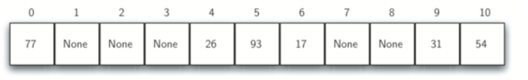
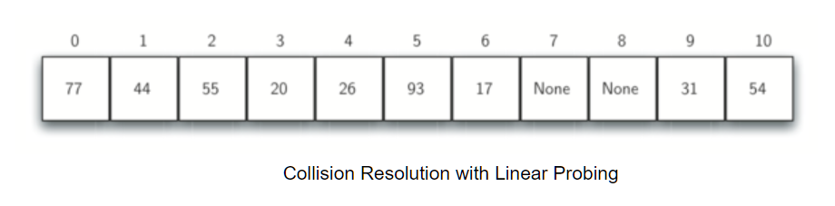
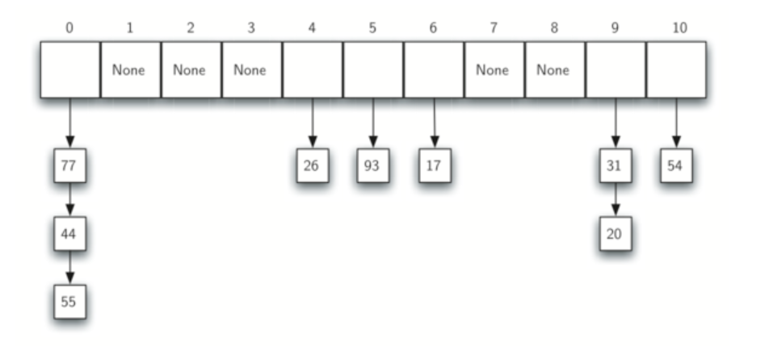

# Week 2 Study Note
## Hashset
### Main API
| Type    | Method               | Description                                                      |
|---------|----------------------|------------------------------------------------------------------|
| boolean | add(x)               | Adds the specified element to this set                           |
| boolean | addAll(Collection c) | Adds all of the elements in the specified collection to this set |
| void    | clear()              | Remove all of the elements from the set                          |
| boolean | **contains()**       | Returns true if this set contains the specified element.         |
| boolean | equals()             | Compares the specified object with this set for equality.        |
| boolean | isEmpty()            | Returns true if this set contains no elements.                   |
| boolean | remove(x)            | Removes the specified element from this set if it is present     |
| boolean | size()               | Returns the number of elements in this set                       |
| Object[]| toArray()            | Returns an array containing all of the elements in this set.     |

## Hashmap
### API
- K - the type of keys maintained by this map
- V - the type of mapped values

| Type     | Method                               | Description                                                               |
|----------|--------------------------------------|---------------------------------------------------------------------------|
| V        | put(key, value)                      | Associates the specified value with the specified key in this map.        |
| boolean  | putAll(Map m)                        | Copies all of the mappings from the specified map to this map.            |
| void     | clear()                              | Remove all of the mappings from the map.                                  |
| V        | remove(key)                          | Removes the mapping for a key from this map if it is present.             |
| int      | size()                               | Returns the number of key-value mappings in the map.                      |
| boolean  | isEmpty()                            | Returns true if this map contains no key-value mappings.                  |
| Set<K>   | **keySet()**                         | Returns a Set view of the keys contained in this map.                     |
| boolean  | **containsKey(key)**                 | Returns true if this map contains a mapping for the specified key.        |
| V        | get(key)                             | Returns the value to which the specified key is mapped.(or null)          |
| V        | **getOrDefault(key, default value)** | Returns the value to which the specified key is mapped.(or default value) |

To solve most of the problems, *getOrDefault()* method is mostly used for counting like:
```
map.put(key, map.getOrDefault(key, 0) + 1) // counting the frequency
```

### Collision Resolution
Referred the [6.5. Hashing](https://runestone.academy/runestone/books/published/pythonds/SortSearch/Hashing.html#fig-hashtable2).
#### Open addressing
One method for resolving collisions looks into the hash table and tries to find **another open slot** to hold the item that caused the collision. A simple way to do this is to start at the original hash value position and then move in a sequential manner through the slots until we encounter the first slot that is empty. 

This collision resolution is referred to as **open addressing** in that it tries to find the next open slot or address in the hash table.

Here is an example.
Figure 1 shows the original contents. 



When we attempt to place 44 into slot 0, a collision occurs. Under linear probing, we look sequentially, slot by slot, until we find an open position. In this case, we find slot 1.

Again, 55 should go in slot 0 but must be placed in slot 2 since it is the next open position. The final value of 20 hashes to slot 9. Since slot 9 is full, we begin to do linear probing. We visit slots 10, 0, 1, and 2, and finally find an empty slot at position 3.



A disadvantage to linear probing is the tendency for clustering; items become clustered in the table. This means that if many collisions occur at the same hash value, a number of surrounding slots will be filled by the linear probing resolution. This will have an impact on other items that are being inserted, as we saw when we tried to add the item 20 above. A cluster of values hashing to 0 had to be skipped to finally find an open position.

#### Chaining
An alternative method for handling the collision problem is to allow each slot to hold a reference to a collection (or chain) of items. **Chaining** allows many items to exist at the same location in the hash table.

When collisions happen, the item is still placed in the proper slot of the hash table. As more and more items hash to the same location, the difficulty of searching for the item in the collection increases. 

Figure 3 shows the items as they are added to a hash table that uses chaining to resolve collisions.

