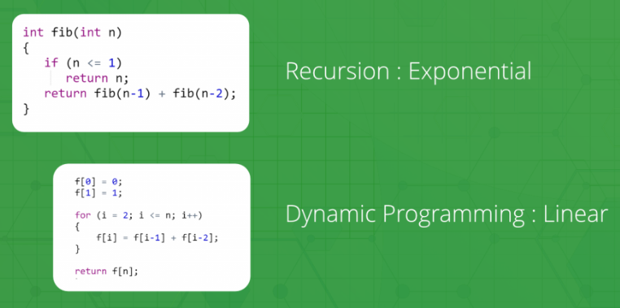

# Week 5 Study Note
## Dynamic Programming
Dynamic Programming is mainly an optimization over plain recursion. Wherever we see a recursive solution that has repeated calls for same inputs, we can optimize it using **Dynamic Programming**. 

The idea is to simply store the results of subproblems, so that we do not have to re-compute them when needed later. 

This simple optimization reduces time complexities from exponential to polynomial. 

For example, if we write simple recursive solution for Fibonacci Numbers, we get exponential time complexity and if we optimize it by storing solutions of subproblems, time complexity reduces to linear.



> Sample Problems:
> |  Problem  | Status |
> |--------- |------- |
> |[Fibonacci Number](https://leetcode.com/problems/fibonacci-number/) | [](https://github.com/Fettes/Coding-Exercise/blob/master/DP/509.fibonacci-number.java) |
> |[Climbing Stairs](https://leetcode.com/problems/climbing-stairs/) | [](https://github.com/Fettes/Coding-Exercise/blob/master/DP/70.climbing-stairs.java)
> |[Min Cost Climbing Stairs](https://leetcode.com/problems/min-cost-climbing-stairs/) | [](https://github.com/Fettes/Coding-Exercise/blob/master/DP/746.min-cost-climbing-stairs.java)


## Dynamic Programming *vs* Divide & Conquer
- Actually no obvious difference. In both contexts it refers to simplifying a complicated problem by breaking it down into simpler sub-problems in a recursive manner. 
- If a problem can be solved optimally by breaking it into sub-problems and then recursively finding the optimal solutions to the sub-problems, then it is said to have **optimal substructure**. We can call it **Dynamic Programming**.
- While some decision problems cannot be taken apart this way, which means we need to solve all the sub-problems. Thus, we call it **Divide & Conquer**.

## Stock problems DP solution
This solution is reposted from this [article](https://leetcode.com/problems/best-time-to-buy-and-sell-stock-with-transaction-fee/discuss/108870/Most-consistent-ways-of-dealing-with-the-series-of-stock-problems). It is really awesome.

Leetcode Problems:
| Problem  | Status |
|--------- |------- |
|[Best Time to Buy and Sell Stock](https://leetcode.com/problems/best-time-to-buy-and-sell-stock/) | [](https://github.com/Fettes/Coding-Exercise/blob/master/DP/121.best-time-to-buy-and-sell-stock.java) |
|[Best Time to Buy and Sell Stock II](https://leetcode.com/problems/best-time-to-buy-and-sell-stock-ii/) | [](https://github.com/Fettes/Coding-Exercise/blob/master/DP/122.best-time-to-buy-and-sell-stock-ii.java) |
|[Best Time to Buy and Sell Stock with Cooldown](https://leetcode.com/problems/best-time-to-buy-and-sell-stock-ii/) | [](https://github.com/Fettes/Coding-Exercise/blob/master/DP/309.best-time-to-buy-and-sell-stock-with-cooldown.java) |
|[Best Time to Buy and Sell Stock with Transaction Fee](https://leetcode.com/problems/best-time-to-buy-and-sell-stock-ii/) | [](https://github.com/Fettes/Coding-Exercise/blob/master/DP/714.best-time-to-buy-and-sell-stock-with-transaction-fee.java) |
|[Best Time to Buy and Sell Stock III](https://leetcode.com/problems/best-time-to-buy-and-sell-stock-iii/) | [](https://github.com/Fettes/Coding-Exercise/blob/master/DP/309.best-time-to-buy-and-sell-stock-with-cooldown.java) |
|[Best Time to Buy and Sell Stock IV](https://leetcode.com/problems/best-time-to-buy-and-sell-stock-iv/) | [](https://github.com/Fettes/Coding-Exercise/blob/master/DP/714.best-time-to-buy-and-sell-stock-with-transaction-fee.java) |


### I -- General Cases
The idea begins with the following question: **Given an array representing the price of stocks on each day, what determines the maximum profit we can obtain?**

First, we need to denote some variables. Let ``prices`` be the stock price array with length ``n``, ``i`` denote the ``i-th`` day (``i`` will go from ``0`` to ``n-1``), ``k`` denote the maximum number of transactions allowed to complete, ``dp[i][k]`` be the maximum profit that could be gained at the end of the ``i-th`` day with at most ``k`` transactions. 

- Base Case: ``dp[-1][k] = dp[i][0] = 0`` which is no stock or no transaction yield no profit (note the first day has ``i = 0`` so ``i = -1`` means no stock)
- Subproblem: ``dp[i-1][k], dp[i][k-1], dp[i-1][k-1]``

Moreover, there are three actions can be taken on ``i-th`` day which is **sell, buy, rest**. However, we don't know which action should we take, thus, we need to traverse all the possible actions to get the maximum profit. For different problem, we have different restrictions. For common cases, we just set one more dimension. 

- If we decide to **buy** on the ``i-th`` day, there should be 0 stock held in our hand before we buy
- If we decide to **sell** on the ``i-th`` day, there should be exactly 1 stock held in our hand before we sell

As a result, we can get:

- ``dp[i][k][0]`` denotes the maximum profit at the end of the ``i-th`` day with at most ``k`` transactions and with ``0`` stock in our hand AFTER taking the action
- ``dp[i][k][1]`` denotes the maximum profit at the end of the ``i-th`` day with at most ``k`` transactions and with ``1`` stock in our hand AFTER taking the action

Now, we need to conclude our dp function with explanation:

- Base Case:
```
//the profit start from ith day, thus we don't have profit at i - 1 day.
dp[-1][k][0] = 0

//we cannot have stock from i - 1 day, thus we cannot get profit
dp[-1][k][1] = -Infinity

//if k = 0 which means we cannot have transactions, therefore the profit is 0
dp[i][0][0] = 0

//we cannot have stock if we cannot have transactions
dp[i][0][1] = -Infinity
```

- Recurrence:
```
/*
For dp[i][k][0] in the recurrence relations, the actions taken on the i-th day can only be rest and sell, since we have 0 stock in our hand at the end of the day. 
- dp[i-1][k][0] is the maximum profit if action rest is taken
- dp[i-1][k][1] + prices[i] is the maximum profit if action sell is taken. 
*/

dp[i][k][0] = max(dp[i-1][k][0], dp[i-1][k][1] + prices[i])

/*
For dp[i][k][1] in the recurrence relations, the actions taken on the i-th day can only be rest and buy, since we have 1 stock in our hand at the end of the day. 
- dp[i-1][k][1] is the maximum profit if action rest is taken
- dp[i-1][k-1][0] - prices[i] is the maximum profit if action buy is taken.
*/

dp[i][k][1] = max(dp[i-1][k][1], dp[i-1][k-1][0] - prices[i])
```

### Best Time to Buy and Sell Stock I (k = 1)
For this problem, we need to have the equation:

```dp[i][1][0] = max(dp[i-1][1][0], dp[i-1][1][1] + prices[i])```

```dp[i][1][1] = max(dp[i-1][1][1], dp[i-1][0][0] - prices[i]) = max(dp[i-1][1][1], -prices[i])```

where we have taken advantage of the base case ``dp[i][0][0] = 0`` for the second equation.

However, we can simplify these equation because k cannot have effect on dp formula:

```dp[i][0] = max(dp[i-1][0], dp[i-1][1] + prices[i])```

```dp[i][1] = max(dp[i-1][1], -prices[i])```


Here we can easily write the code:
```
class Solution {
    public int maxProfit(int[] prices) {
        //Actually, we can save the space with only two variables.
        int dp_i_0 = 0;
        int dp_i_1 = Integer.MIN_VALUE;

        for (int i = 0; i < prices.length; i++) {
            dp_i_0 = Math.max(dp_i_0, dp_i_1 + prices[i]);
            dp_i_1 = Math.max(dp_i_1, -prices[i]);
        }
        return dp_i_0;
    }
}
```

### Best Time to Buy and Sell Stock II (k = +Infinity)
For this problem, we need to have the equation:

```dp[i][k][0] = max(dp[i-1][k][0], dp[i-1][k][1] + prices[i])```

```dp[i][k][1] = max(dp[i-1][k][1], dp[i-1][k-1][0] - prices[i]) = max(dp[i-1][k][1], dp[i-1][k][0] - prices[i])```

where we have taken advantage of the fact that ``T[i-1][k-1][0] = T[i-1][k][0]`` for the second equation.

Here we can easily write the code:
```
class Solution {
    public int maxProfit(int[] prices) {
        int dp_i_0 = 0;
        int dp_i_1 = Integer.MIN_VALUE;

        for (int i = 0; i < prices.length; i++) {
            int temp = dp_i_0;
            dp_i_0 = Math.max(dp_i_0, dp_i_1 + prices[i]);
            dp_i_1 = Math.max(dp_i_1, temp - prices[i]);
        }
        return dp_i_0;
    }
}
```

### Best Time to Buy and Sell Stock with Cooldown (k = +Infinity but with cooldown)
For this problem, we need to have the equation:

```dp[i][k][0] = max(dp[i-1][k][0], dp[i-1][k][1] + prices[i])```

```dp[i][k][1] = max(dp[i-1][k][1], dp[i-2][k][0] - prices[i])```

With "cooldown", we cannot buy on the ``i-th`` day if a stock is sold on the (i-1)-th day. Therefore, in the second equation above, instead of ``dp[i-1][k][0]``, we should actually use ``dp[i-2][k][0]`` if we intend to buy on the ``i-th`` day. Everything else remains the same.

Here we can write the code:
```
class Solution {
    public int maxProfit(int[] prices) {
        int dp_i_0 = 0;
        int dp_i_1 = Integer.MIN_VALUE;
        int dp_i_2 = 0;

        for (int i = 0; i < prices.length; i++) {
            int temp = dp_i_0;
            dp_i_0 = Math.max(dp_i_0, dp_i_1 + prices[i]);
            dp_i_1 = Math.max(dp_i_1, dp_i_2 - prices[i]);
            dp_i_2 = temp;
        }
        
        return dp_i_0;
    }
}
```

### Best Time to Buy and Sell Stock with Transaction Fee (k = +infinity with fee)
For this problem, we can just add transaction fee like:

```dp[i][k][0] = max(dp[i-1][k][0], dp[i-1][k][1] + prices[i])```

```dp[i][k][1] = max(dp[i-1][k][1], dp[i-1][k][0] - prices[i] - fee)```

Here we can write the code:
```
class Solution {
    public int maxProfit(int[] prices, int fee) {
        int dp_i_0 = 0;
        int dp_i_1 = Integer.MIN_VALUE;

        for (int i = 0; i < prices.length; i++) {
            int temp = dp_i_0;
            dp_i_0 = Math.max(dp_i_0, dp_i_1 + prices[i]);
            dp_i_1 = Math.max(dp_i_1, temp - prices[i] - fee);
        }
        return dp_i_0;
    }
}
```

### Best Time to Buy and Sell Stock III (k = 2)
For this problem, we need to have the equation:

```dp[i][k][0] = max(dp[i-1][k][0], dp[i-1][k][1] + prices[i])```

```dp[i][k][1] = max(dp[i-1][k][1], dp[i-1][k-1][0] - prices[i])```

However, k have effect on the profit now which means we need to traverse all the possible k.

```
class Solution {
    public int maxProfit(int[] prices) {
        int n = prices.length;
        if (n == 0) {
            return 0;
        }
        
        int maxK = 2;
        int[][][] dp = new int[n][maxK + 1][2];

        for (int i = 0; i < prices.length; i++) {
            for (int k = maxK; k >= 1; k--) {
                if (i - 1 == -1) {
                    dp[i][k][0] = 0;
                    dp[i][k][1] = -prices[i];
                    continue;
                }
                dp[i][k][0] = Math.max(dp[i - 1][k][0], dp[i - 1][k][1] + prices[i]);
                dp[i][k][1] = Math.max(dp[i - 1][k][1], dp[i - 1][k - 1][0] - prices[i]);
            }
        }
        
        return dp[n - 1][maxK][0];
    }
}
```

Actually, we can optimize the memory if we simply traverse all possible k:

```
class Solution {
    public int maxProfit(int[] prices) {
        int dp_i_1_0 = 0;
        int dp_i_1_1 = Integer.MIN_VALUE;
        int dp_i_2_0 = 0;
        int dp_i_2_1 = Integer.MIN_VALUE;

        for (int i = 0; i < prices.length; i++) {
            dp_i_2_0 = Math.max(dp_i_2_0, dp_i_2_1 + prices[i]);
            dp_i_2_1 = Math.max(dp_i_2_1, dp_i_1_0 - prices[i]);
            dp_i_1_0 = Math.max(dp_i_1_0, dp_i_1_1 + prices[i]);
            dp_i_1_1 = Math.max(dp_i_1_1, -prices[i]);
        }
        
        return dp_i_2_0;
    }
}
```

### Best Time to Buy and Sell Stock IV (k is arbitrary)
A profitable transaction takes at least two days. If the length of the prices array is ``n``, the maximum number of profitable transactions is ``n/2`` (integer division). After that no profitable transaction is possible, which implies the maximum profit will stay the same. 

Therefore the critical value of ``k`` is ``n/2``. If the given k is no less than this value, i.e., ``k >= n/2``, we can extend k to positive infinity and the problem is equivalent to [Case II](#best-time-to-buy-and-sell-stock-ii-k--infinity).

With the same equation, we can write the code:
```
class Solution {
    public int maxProfit(int k, int[] prices) {
        int n = prices.length;
        if (n == 0) {
            return 0;
        }
        if (k > n / 2) {
            return maxProfit_caseII(prices);
        }
        
        int[][][] dp = new int[n][k + 1][2];

        for (int i = 0; i < prices.length; i++) {
            for (int j = k; j >= 1; j--) {
                if (i - 1 == -1) {
                    dp[i][j][0] = 0;
                    dp[i][j][1] = -prices[i];
                    continue;
                }
                dp[i][j][0] = Math.max(dp[i - 1][j][0], dp[i - 1][j][1] + prices[i]);
                dp[i][j][1] = Math.max(dp[i - 1][j][1], dp[i - 1][j - 1][0] - prices[i]);
            }
        }
        
        return dp[n - 1][k][0];
    }

    public int maxProfit_caseII(int[] prices) {
        int dp_i_0 = 0;
        int dp_i_1 = Integer.MIN_VALUE;

        for (int i = 0; i < prices.length; i++) {
            int temp = dp_i_0;
            dp_i_0 = Math.max(dp_i_0, dp_i_1 + prices[i]);
            dp_i_1 = Math.max(dp_i_1, temp - prices[i]);
        }
        return dp_i_0;
    }
}
```