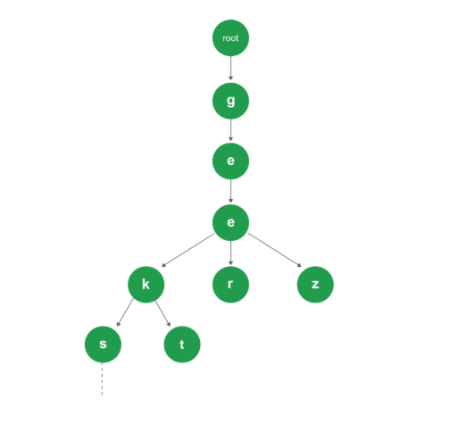

# Week 7 Study Note
## Trie
### Introduction
Trie is an efficient information re*trie*val data structure. Using Trie, search complexities can be brought to optimal limit (key length). 

If we store keys in binary search tree, a well balanced BST will need time **proportional** to **M * log N**, where M is maximum string length and N is number of keys in tree. 

Using Trie, we can search the key in **O(M)** time. However the penalty is on Trie storage requirements.



- Every node of Trie consists of multiple branches. 
- Each branch represents a possible character of keys. 
- We need to mark the last node of every key as end of word node. A Trie node field *isEndOfWord* is used to distinguish the node as end of word node.

### Implementation
Here is my implementation: [Implement Trie (Prefix Tree)](https://leetcode.com/problems/implement-trie-prefix-tree/) 

[](https://github.com/Fettes/Coding-Exercise/blob/master/Trie/208.implement-trie-prefix-tree.java)


Here is the implementation from GeeksForGeeks:
```
// Java implementation of search and insert operations 
// on Trie 
public class Trie { 
	
	// Alphabet size (# of symbols) 
	static final int ALPHABET_SIZE = 26; 
	
	// trie node 
	static class TrieNode 
	{ 
		TrieNode[] children = new TrieNode[ALPHABET_SIZE]; 
	
		// isEndOfWord is true if the node represents 
		// end of a word 
		boolean isEndOfWord; 
		
		TrieNode(){ 
			isEndOfWord = false; 
			for (int i = 0; i < ALPHABET_SIZE; i++) 
				children[i] = null; 
		} 
	}; 
	
	static TrieNode root; 
	
	// If not present, inserts key into trie 
	// If the key is prefix of trie node, 
	// just marks leaf node 
	static void insert(String key) 
	{ 
		int level; 
		int length = key.length(); 
		int index; 
	
		TrieNode pCrawl = root; 
	
		for (level = 0; level < length; level++) 
		{ 
			index = key.charAt(level) - 'a'; 
			if (pCrawl.children[index] == null) 
				pCrawl.children[index] = new TrieNode(); 
	
			pCrawl = pCrawl.children[index]; 
		} 
	
		// mark last node as leaf 
		pCrawl.isEndOfWord = true; 
	} 
	
	// Returns true if key presents in trie, else false 
	static boolean search(String key) 
	{ 
		int level; 
		int length = key.length(); 
		int index; 
		TrieNode pCrawl = root; 
	
		for (level = 0; level < length; level++) 
		{ 
			index = key.charAt(level) - 'a'; 
	
			if (pCrawl.children[index] == null) 
				return false; 
	
			pCrawl = pCrawl.children[index]; 
		} 
	
		return (pCrawl != null && pCrawl.isEndOfWord); 
	} 
	
	// Driver 
	public static void main(String args[]) 
	{ 
		// Input keys (use only 'a' through 'z' and lower case) 
		String keys[] = {"the", "a", "there", "answer", "any", 
						"by", "bye", "their"}; 
	
		String output[] = {"Not present in trie", "Present in trie"}; 
	
	
		root = new TrieNode(); 
	
		// Construct trie 
		int i; 
		for (i = 0; i < keys.length ; i++) 
			insert(keys[i]); 
	
		// Search for different keys 
		if(search("the") == true) 
			System.out.println("the --- " + output[1]); 
		else System.out.println("the --- " + output[0]); 
		
		if(search("these") == true) 
			System.out.println("these --- " + output[1]); 
		else System.out.println("these --- " + output[0]); 
		
		if(search("their") == true) 
			System.out.println("their --- " + output[1]); 
		else System.out.println("their --- " + output[0]); 
		
		if(search("thaw") == true) 
			System.out.println("thaw --- " + output[1]); 
		else System.out.println("thaw --- " + output[0]); 
		
	} 
} 
// This code is contributed by Sumit Ghosh 

```

## Union Find

### Template
```
// Java
class UnionFind { 
	private int count = 0; 
	private int[] parent; 
	public UnionFind(int n) { 
		count = n; 
		parent = new int[n]; 
		for (int i = 0; i < n; i++) { 
			parent[i] = i;
		}
	} 
	public int find(int p) { 
		while (p != parent[p]) { 
			parent[p] = parent[parent[p]]; 
			p = parent[p]; 
		}
		return p; 
	}
	public void union(int p, int q) { 
		int rootP = find(p); 
		int rootQ = find(q); 
		if (rootP == rootQ) return; 
		parent[rootP] = rootQ; 
		count--;
	}
}
```

> Sample Problems:
> |  Problem  | Status |
> |--------- |------- |
> |[Surrounded Regions](https://leetcode.com/problems/surrounded-regions/) | [](https://github.com/Fettes/Coding-Exercise/blob/master/Union%20Find/130.surrounded-regions.java) |
> |[Number of Islands](https://leetcode.com/problems/number-of-islands/) | [](https://github.com/Fettes/Coding-Exercise/blob/master/Union%20Find/200.number-of-islands.java)
> |[Friend Circles](https://leetcode.com/problems/friend-circles/) | [](https://github.com/Fettes/Coding-Exercise/blob/master/Union%20Find/547.friend-circles.java)