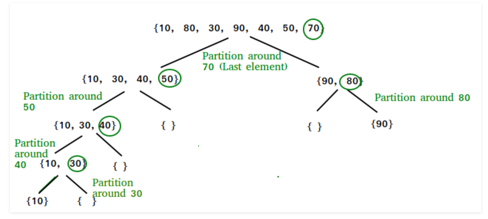
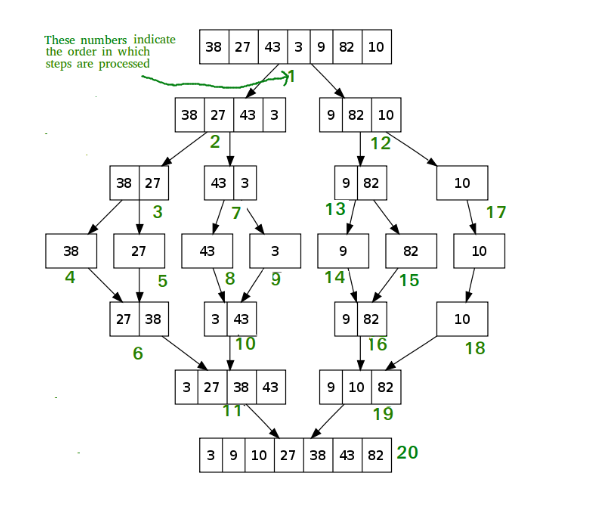

# Week 8 Study Note
## Sort Algorithm
### Quick Sort
Like [Merge Sort](#merge-sort), QuickSort is a Divide and Conquer algorithm. It picks an element as pivot and partitions the given array around the picked pivot. There are many different versions of quickSort that pick pivot in different ways.



- Always pick first element as pivot.
- Always pick last element as pivot (implemented below)
- Pick a random element as pivot.
- Pick median as pivot.


The **key process** in quickSort is partition(). 

Target of partitions is, given an array and an element x of array as pivot, put x at its correct position in sorted array and put all smaller elements (smaller than x) before x, and put all greater elements (greater than x) after x. All this should be done in linear time.

```
/* 
	The main function that implements QuickSort() 
	arr[] --> Array to be sorted, 
	low --> Starting index, 
	high --> Ending index 
*/

void quickSort(int Arr[], int low, int high) { 
	if (low > high) return; 
	/* pi is partitioning index, Arr[pi] is now at right place */
	int pi = partition(Arr, low, high); 

	// Recursively sort elements before partition and after partition 
	quickSort(Arr, low, pi - 1); 
	quickSort(Arr, pi + 1, high);  
}

/* 
	This function takes last element as pivot, places the pivot element at its correct position in sorted array, 
	and places all smaller (smaller than pivot) to left of pivot and all greater elements to right of pivot.
*/
int partition(int Arr[], int low, int high) { 
	int pivot = Arr[high]; 
	int i = low - 1; // index of smaller element 

	for (int j = low; j < high; j++) { 
		// If current element is smaller than or equal to pivot 
		if (Arr[j] <= pivot) { 
			i++; 

			// swap Arr[i] and Arr[j] 
			int temp = Arr[i]; 
			Arr[i] = Arr[j]; 
			Arr[j] = temp; 
		} 
	} 

	// swap Arr[i + 1] and Arr[high] (or pivot) 
	int temp = Arr[i + 1]; 
	Arr[i + 1] = Arr[high]; 
	Arr[high] = temp; 

	return i + 1; 
} 
```

### Merge Sort
Like [QuickSort](#quick-sort), Merge Sort is a Divide and Conquer algorithm. 

It divides input array in two halves, calls itself for the two halves and then merges the two sorted halves. 

The merge() function is used for merging two halves. The merge(arr, l, m, r) is key process that assumes that arr[l..m] and arr[m+1..r] are sorted and merges the two sorted sub-arrays into one. 



```
// example of merge sort in Java

// Arr is an array of integer type
// start and end are the starting and ending index of current interval of Arr

void mergeSort(int Arr[], int start, int end) {
    if (end <= start) return;
	
    int mid = (start + end) / 2;
	mergeSort(Arr, start, mid);
	mergeSort(Arr, mid + 1, end);
	merge(Arr, start, end);
}

// merge function take two intervals
// one from start to mid
// second from mid + 1, to end
// and merge them in sorted order

void merge(int Arr[], int start, int end) {

	// create a temp array
	int temp[] = new int[end - start + 1];

	// crawlers for both intervals and for temp
	int mid = (start + end) / 2;
	int i = start, j = mid + 1, k = 0;

	// traverse both arrays and in each iteration add smaller of both elements in temp 
	while(i <= mid && j <= end) {
        temp[k++] = Arr[i] <= Arr[j] ? Arr[i++] : Arr[j++];
	}

	// add elements left in the first interval 
	while(i <= mid) {
		temp[k++] = Arr[i++];
	}

	// add elements left in the second interval 
	while(j <= end) {
		temp[k++] = Arr[j++];
	}

	// copy temp to original interval
	for(i = start; i <= end; i += 1) {
		Arr[i] = temp[i - start];
	}
}
```

> Sample Problems:
> |  Problem  | Status |
> |--------- |------- |
> |[Count of Smaller after self](https://leetcode.com/problems/count-of-smaller-numbers-after-self/) | [](https://github.com/Fettes/Coding-Exercise/blob/master/Divide%20And%20Conquer/315.count-of-smaller-numbers-after-self.java)
> |[Count of Range Sum](https://leetcode.com/problems/count-of-range-sum/) | [](https://github.com/Fettes/Coding-Exercise/blob/master/Divide%20And%20Conquer/327.count-of-range-sum.java)
> |[Reverse Pairs](https://leetcode.com/problems/reverse-pairs/) | [](https://github.com/Fettes/Coding-Exercise/blob/master/Divide%20And%20Conquer/493.reverse-pairs.java) |
